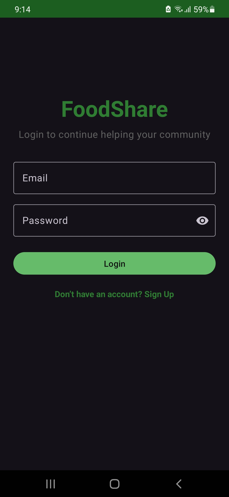
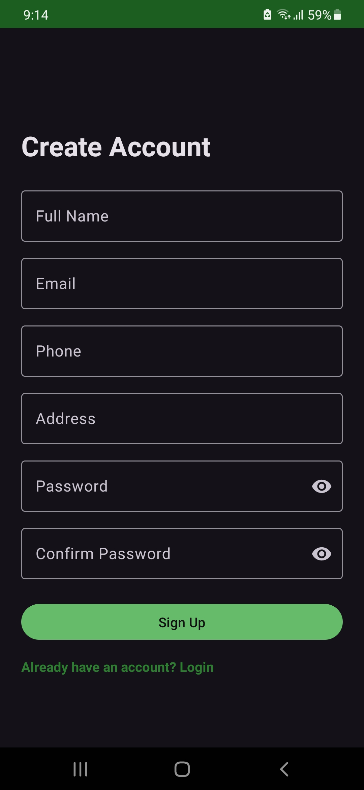
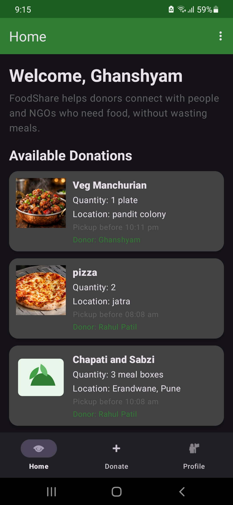
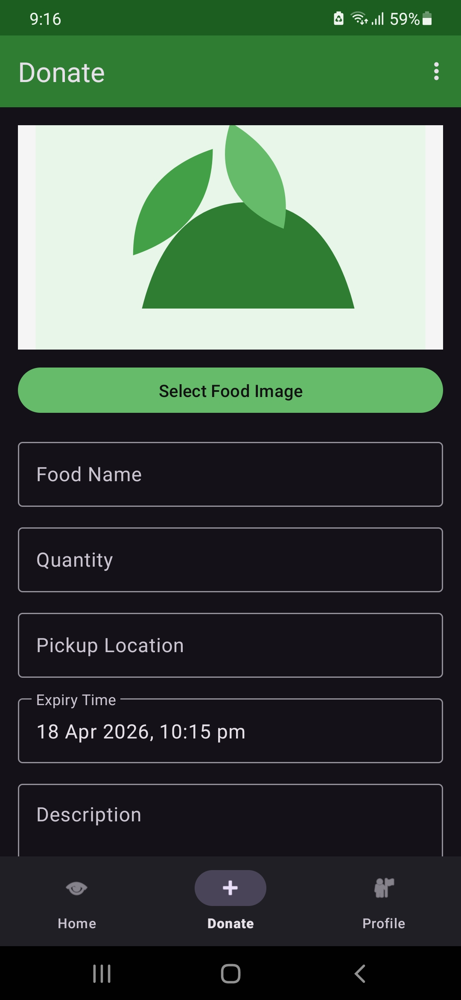
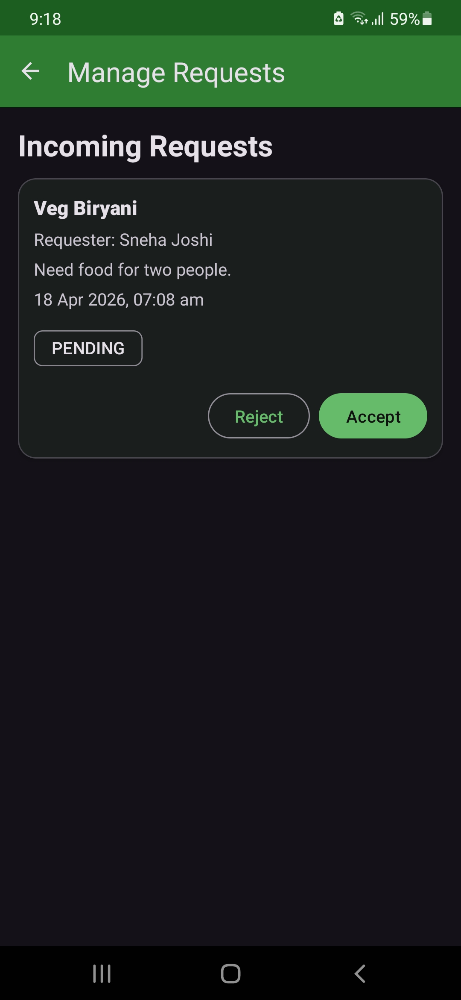
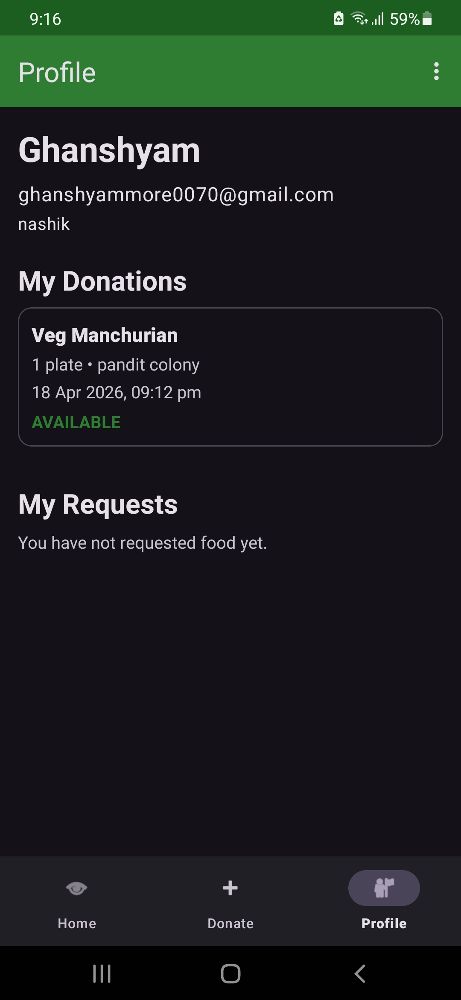

# FoodShare – Food Donation App

## Overview
FoodShare is an Android application designed to reduce food wastage by connecting donors with people in need.

## Features
- User Authentication
- Donate Food
- Request Food
- Profile Management
- Offline Support using Room Database
- Local Image Storage

## Tech Stack
- Kotlin
- Android Studio
- MVVM Architecture
- Room Database

## Screenshots

  
  
  

  
  
  

## How to Run
1. Clone the repository
2. Open in Android Studio
3. Build & Run

## Author
Ghanshyam More
